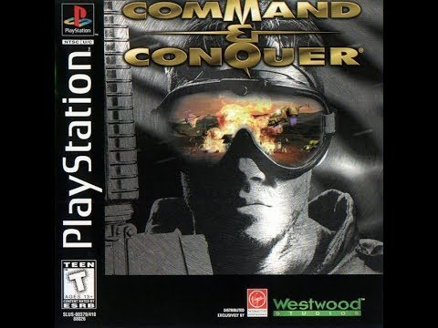
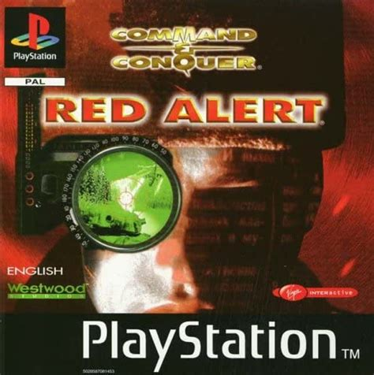
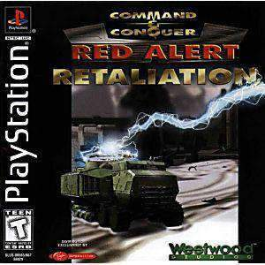

# cnc-psx-tools

Modding tools for Command &amp; Conquer games released on the Sony Playstation

**Supported Games**

Command & Conquer (any region)



Command & Conquer - Red Alert (any region)



Command & Conquer - Red Alert Retaliation (aka "Command & Conquer - Retaliation" - any region)



---

NOTE: The FAT file format used in these games is documented here: https://github.com/djfdyuruiry/cnc-psx-tools/blob/main/docs/fat-format.md

---

To build:

- Install the dotnet 6 SDK
- Run: `dotnet build`

### Note: Getting Data Files

Use the `dumpsxio` utility to extract files from a C&C playstation disc image: https://github.com/Lameguy64/mkpsxiso

## Mix Manager

Cross platform desktop UI app for opening MIX/XA files and editing/replacing/deleting/adding files in them. 

Once you edit the DATA.FAT and DATA.MIX, you can use `mkpsxiso` to repackage the C&C disc image to run it in an emulator or on real hardware: https://github.com/Lameguy64/mkpsxiso

### Building For Linux

By default this app builds a self contained windows app, to target linux instead run the below commands:

```
# build for linux
cd MixFileManager
dotnet publish -c Release -r linux-x64 --self-contained -p:PublishReadyToRun=true

# run the app
./bin/Release/net6.0/linux-x64/MixFileManager
```

## FAT File Parser

CLI tool to parse the listing of files contained in a FAT file. These can be output to the console or a YAML file.

## MIX File Extractor

CLI tool to extract files from a MIX file, supports filters for targeting/ignore certain files.

## CNC PSX Library

C# class library for examining and interacting with files found in C&C games.

- FAT file parsing
- MIX file reading

---

## Ideas

- Image/Video viewer in Mix Manager
- Unit/Building etc. editor - class instance identical to PC code can be found with same constructor parameter values, could manipulage psx program binary to edit
